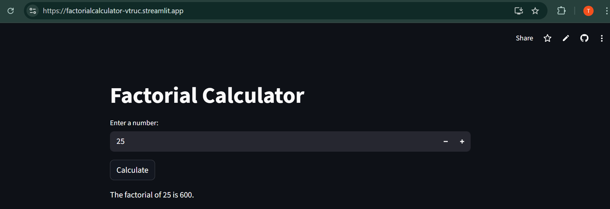
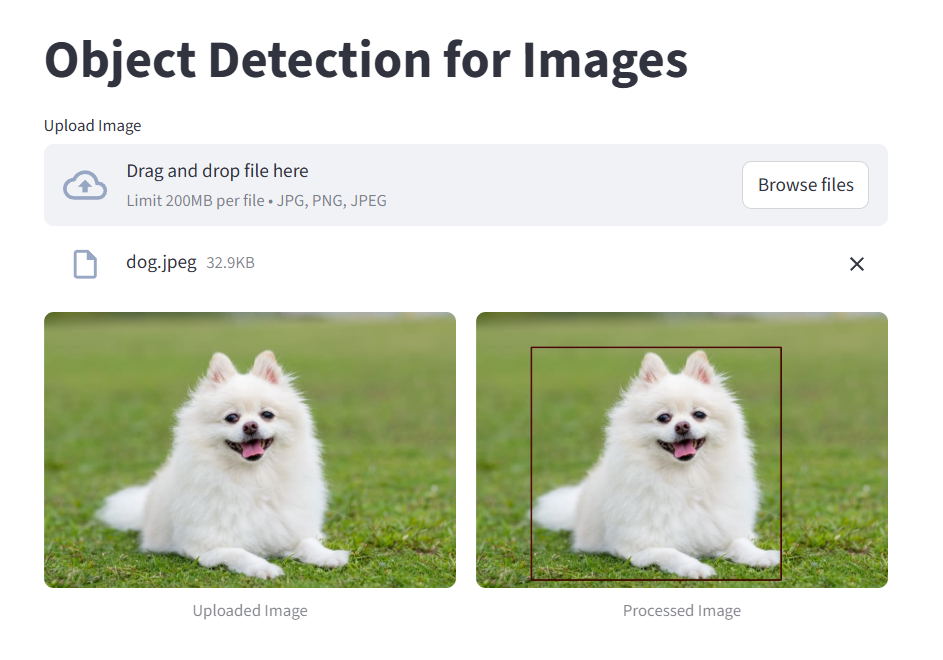

# Streamlit Mini Projects Collection

This repository contains several **interactive Streamlit applications** demonstrating different concepts in **Python, Natural Language Processing, Computer Vision, and Conversational AI**.

The projects include:

- [Project 1: Factorial Calculator App using Streamlit](#project-1-factorial-calculator-app-using-streamlit)
- [Project 2: Word Correction using Levenshtein Distance](#project-2-word-correction-using-levenshtein-distance)
- [Project 3: Object Detection for Images](#project-3-object-detection-for-images)
- [Project 4: Simple Chatbot using HugChat](#project-4-simple-chatbot-using-hugchat)

Each application demonstrates how **Streamlit can quickly transform Python scripts into interactive web applications**.

---

# Project 1: Factorial Calculator App using Streamlit

This project is a simple **Streamlit web application** that calculates the **factorial of a number** entered by the user.

The application demonstrates:

* Basic **Python function implementation**
* **Recursive mathematical logic**
* Building an interactive **Streamlit UI**
* Deploying a Python app to the web using **Streamlit Cloud**

### Live Application

[https://factorialcalculator-vtruc.streamlit.app/](https://factorialcalculator-vtruc.streamlit.app/)

### GitHub Repository

[https://github.com/trucvoviet/Factorial-Calculator-App-using-Streamlit](https://github.com/trucvoviet/Factorial-Calculator-App-using-Streamlit)

---

# What is Factorial?

The **factorial** of a number ( n ) is the product of all positive integers from **1 to n**.

```
n! = 1 × 2 × 3 × ... × n
```

A factorial can also be defined using **recursion**:

```
n! = n × (n-1)!
```

with the base case:

```
0! = 1
```

---

# Examples

### Example 1: 3!

```
3! = 3 × 2 × 1
   = 6
```

### Example 2: 5!

```
5! = 5 × 4 × 3 × 2 × 1
   = 120
```

---

# Project Structure

```
Factorial-Calculator-App-using-Streamlit
│
├── app.py
├── factorial.py
├── requirements.txt
├── README.md
│
└── imgs
    └── factapp.png
```

---

# Step 1 — Create Project Folder

Create a folder for the project:

```
Factorial Calculation App
```

Open the folder in **VSCode** using Git Bash:

```bash
code .
```

---

# Step 2 — Open Terminal

In VSCode press:

```
Ctrl + ~
```

Then open **Command Prompt (cmd)** inside the terminal.

---

# Step 3 — Check Python Version

Verify Python installation.

```bash
python --version
```

or

```bash
python -V
```

---

# Step 4 — Create Virtual Environment

Create a **conda environment**:

```bash
conda create --name fact_env python=3.11.7
```

Activate the environment:

```bash
conda activate fact_env
```

---

# Step 5 — Install Dependencies

Install required libraries:

```bash
pip install -r requirements.txt
```

Main dependency:

```
streamlit
```

---

# Step 6 — Factorial Function

Create file:

```
factorial.py
```

Add the factorial function.

```python
# factorial.py

# Function to calculate factorial using recursion
def fact(n):
    if n == 0 or n == 1:
        return 1
    else:
        return n * fact(n - 1)
```

---

# Step 7 — Streamlit User Interface

Create file:

```
app.py
```

```python
# app.py

# Import Streamlit library
import streamlit as st

# Import factorial function
from factorial import fact


def main():

    # Application title
    st.title("Factorial Calculator")

    # User input
    number = st.number_input(
        "Enter a number:",
        min_value=0,
        max_value=999
    )

    # Calculate factorial when button is clicked
    if st.button("Calculate"):

        result = fact(number)

        st.write(f"The factorial of {number} is {result}.")
        st.balloons()


if __name__ == "__main__":
    main()
```

---

# Fix Streamlit Import Error in VSCode

If `streamlit` shows an error underline:

Press:

```
Ctrl + Shift + P
```

Select:

```
Python: Select Interpreter
```

Choose:

```
fact_env
```

---

# Run Application Locally

```bash
streamlit run app.py
```

---

# Deploy on Streamlit Cloud

Go to:

[https://streamlit.io](https://streamlit.io)

Click **New App** and configure:

```
Repository:
trucvoviet/Factorial-Calculator-App-using-Streamlit

Branch:
main

Main file path:
app.py

App URL:
factorialcalculator-vtruc.streamlit.app
```

Click **Deploy**.

---

# Application Output



---

# Project 2: Word Correction using Levenshtein Distance

**Word Correction (Spell Checking)** is a fundamental application of **Natural Language Processing (NLP)**.

The goal is to detect a **misspelled word** and suggest the **closest correct word**.

Example:

```
Input: hel
Output: hello
```

This project uses **Levenshtein Distance**, which measures the **minimum number of edits** required to transform one word into another.

Possible edits include:

* Insertion
* Deletion
* Substitution

---

# Vocabulary File

Create file:

```
vocab.txt
```

Example vocabulary:

```
apple
book
dog
hello
never
please
random
sleep
start
understand
```

---

# Create Environment

```bash
conda create --name levenshteindistance_env python=3.11.7
```

Activate environment:

```bash
conda activate levenshteindistance_env
```

---

# Levenshtein Distance Implementation

Create file:

```
levenshteindistance.py
```

```python
# Import libraries
import streamlit as st


# Function to compute Levenshtein Distance
def levenshtein_distance(token1, token2):

    distances = [[0]*(len(token2)+1) for i in range(len(token1)+1)]

    for t1 in range(len(token1) + 1):
        distances[t1][0] = t1

    for t2 in range(len(token2) + 1):
        distances[0][t2] = t2

    for t1 in range(1, len(token1) + 1):
        for t2 in range(1, len(token2) + 1):

            if token1[t1-1] == token2[t2-1]:
                distances[t1][t2] = distances[t1-1][t2-1]

            else:
                a = distances[t1][t2-1]
                b = distances[t1-1][t2]
                c = distances[t1-1][t2-1]

                distances[t1][t2] = min(a, b, c) + 1

    return distances[len(token1)][len(token2)]


# Load vocabulary
def load_vocab(file_path):
    with open(file_path, 'r') as f:
        lines = f.readlines()

    words = sorted(set([line.strip().lower() for line in lines]))

    return words


vocabs = load_vocab('vocab.txt')


# Streamlit UI
st.title("Word Correction using Levenshtein Distance")

word = st.text_input('Your Word:')


if st.button("Compute"):

    leven_distances = {}

    for vocab in vocabs:
        leven_distances[vocab] = levenshtein_distance(word, vocab)

    sorted_distences = dict(sorted(leven_distances.items(), key=lambda item: item[1]))

    correct_word = list(sorted_distences.keys())[0]

    st.write("Correct word:", correct_word)

    col1, col2 = st.columns(2)

    col1.write("Vocabulary:")
    col1.write(vocabs)

    col2.write("Distances:")
    col2.write(sorted_distences)
```

---

# Project 3: Object Detection for Images

**Object Detection** is a key application of **Computer Vision**.

The goal is to detect **objects inside an image and draw bounding boxes around them**.

This project uses:

* **OpenCV DNN module**
* **MobileNet SSD pre-trained model**
* **Streamlit interface**

---

# Install Required Library

```
pip install opencv-python
```

---

# Object Detection Code

```python
import cv2
import numpy as np
from PIL import Image
import streamlit as st

MODEL = "model/MobileNetSSD_deploy.caffemodel"
PROTOTXT = "model/MobileNetSSD_deploy.prototxt.txt"


# Run image through DNN model
def process_image(image):

    blob = cv2.dnn.blobFromImage(
        cv2.resize(image, (300, 300)),
        0.007843,
        (300, 300),
        127.5
    )

    net = cv2.dnn.readNetFromCaffe(PROTOTXT, MODEL)
    net.setInput(blob)

    detections = net.forward()

    return detections


# Draw bounding boxes
def annotate_image(image, detections, confidence_threshold=0.5):

    (h, w) = image.shape[:2]

    for i in np.arange(0, detections.shape[2]):

        confidence = detections[0, 0, i, 2]

        if confidence > confidence_threshold:

            idx = int(detections[0, 0, i, 1])

            box = detections[0, 0, i, 3:7] * np.array([w, h, w, h])

            (startX, startY, endX, endY) = box.astype("int")

            cv2.rectangle(image, (startX, startY), (endX, endY), 70, 2)

    return image


# Streamlit App
def main():

    st.title('Object Detection for Images')

    file = st.file_uploader('Upload Image', type=['jpg', 'png', 'jpeg'])

    if file is not None:

        image = Image.open(file)

        image_np = np.array(image)

        detections = process_image(image_np)

        processed_image = annotate_image(image_np, detections)

        col1, col2 = st.columns(2)

        with col1:
            st.image(image, caption="Uploaded Image", use_container_width=True)

        with col2:
            st.image(processed_image, caption="Processed Image", use_container_width=True)


if __name__ == "__main__":
    main()
```

---

# Output Example



---

# Project 4: Simple Chatbot using HugChat

Chatbots are one of the most popular applications of **Large Language Models (LLMs)**.

This project builds a **simple chatbot interface** using:

* **HugChat**
* **Hugging Face authentication**
* **Streamlit chat interface**

---

# Install HugChat

```
pip install hugchat
```

---

# Chatbot Application

```python
import streamlit as st
from hugchat import hugchat
from hugchat.login import Login


st.title('Simple ChatBot')


with st.sidebar:

    st.title('Login HugChat')

    hf_email = st.text_input('Enter E-mail:')

    hf_pass = st.text_input('Enter Password:', type='password')

    if not (hf_email and hf_pass):
        st.warning('Please enter your account!', icon='⚠️')
    else:
        st.success('Proceed to entering your prompt message!', icon='👉')


# Initialize chat history
if "messages" not in st.session_state.keys():

    st.session_state.messages = [
        {"role": "assistant", "content": "How may I help you?"}
    ]


# Display previous messages
for message in st.session_state.messages:

    with st.chat_message(message["role"]):
        st.write(message["content"])


# Function to generate response
def generate_response(prompt_input, email, passwd):

    sign = Login(email, passwd)

    cookies = sign.login()

    chatbot = hugchat.ChatBot(cookies=cookies.get_dict())

    return chatbot.chat(prompt_input)


# User input
if prompt := st.chat_input(disabled=not (hf_email and hf_pass)):

    st.session_state.messages.append({"role": "user", "content": prompt})

    with st.chat_message("user"):
        st.write(prompt)


# Generate assistant response
if st.session_state.messages[-1]["role"] != "assistant":

    with st.chat_message("assistant"):

        with st.spinner("Thinking..."):

            response = generate_response(prompt, hf_email, hf_pass)

            st.write(response)

    st.session_state.messages.append({"role": "assistant", "content": response})
```

---

# Technologies Used

* Python
* Streamlit
* OpenCV
* HugChat
* NumPy
* PIL
* Conda
* GitHub
* Streamlit Cloud

---

